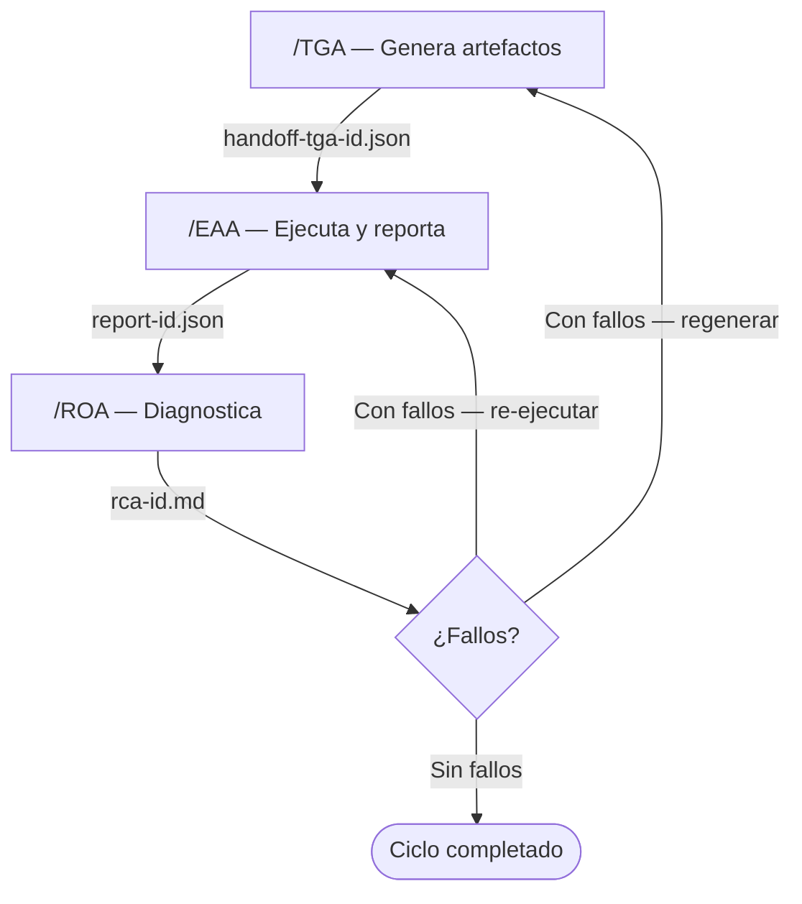

# Arquitectura ATA

## Agentes Especializados

Cada agente es una **sesión efímera** de Copilot con identidad, herramientas y responsabilidades
acotadas. Se activan desde el selector de agentes del chat o escribiendo el prefijo correspondiente.

| Agente | Prefijo / Activación | Patrón interno | Responsabilidad |
|--------|---------------------|----------------|------------------|
| **ATA Stack Setup** | Selector de agentes / hook automático | Entrevista conversacional | Entrevista al desarrollador para completar STACK.yml interactivamente |
| **TGA** | `/TGA` | Reflection (Generator-Critic) | Transforma requisitos en artefactos de prueba ejecutables |
| **EAA** | `/EAA` | Parallel Fan-Out + Synthesis | Ejecuta suites en múltiples entornos y produce reportes normalizados |
| **ROA** | `/ROA` | Reflexive Metacognitive + Ensemble | Diagnostica causas raíz y emite recomendaciones accionables |

### Resolución de herramientas por agente

Las herramientas concretas se resuelven en tiempo de ejecución desde `STACK.yml`. La tabla siguiente muestra **qué sección de STACK.yml** consume cada agente:

| Sección de STACK.yml | TGA | EAA | ROA |
|---------------------|:---:|:---:|:---:|
| `tga_skills.*` (unit, bdd, e2e, performance, ai_assisted) | ✓ | — | — |
| `eaa_skills.test_runner` + `browser_targets` | — | ✓ | — |
| `eaa_skills.coverage_reporter` + `performance_runner` | — | ✓ | — |
| `roa_skills.static_analysis` + `code_review_ai` | — | — | ✓ |
| `roa_skills.defect_tracking` + `log_analysis` | — | — | ✓ |

---

## Ciclo Cerrado de Validación (CCV)

El flujo de trabajo sigue una secuencia unidireccional con retorno controlado:

Cada transferencia entre agentes se realiza mediante un **manifiesto de handoff JSON** depositado en `/reports/execution/`. 
Ningún agente puede asumir el resultado de una sesión anterior sin que dicho artefacto esté presente en el contexto.

**Límite de convergencia:** el CCV se detiene automáticamente tras 5 ciclos sin reducción de fallos y escala el historial completo al equipo de desarrollo.

---

## Patrones Arquitectónicos Implementados

La suite combina patrones de los tres marcos de referencia principales en arquitecturas agénticas:

| Patrón | Aplicación en ATA |
|--------|-------------------|
| **Sequential** | Flujo TGA → EAA → ROA (orden fijo, salida es input del siguiente) |
| **Parallel Fan-Out + Synthesis** | EAA ejecuta en chromium / firefox / webkit simultáneamente |
| **Reflection (Generator-Critic)** | TGA auto-valida cobertura ≥ 80 % antes de entregar artefactos |
| **Iterative Refinement** | Loop interno de TGA: máx. 3 iteraciones con condición de salida explícita |
| **Reflexive Metacognitive** | ROA escala a humano cuando la confianza del diagnóstico es < 50 % |
| **Ensemble** | ROA genera hipótesis paralelas H1/H2 cuando el delta de confianza es < 20 % |
| **Human-in-the-Loop + Dry-Run** | Operaciones destructivas requieren aprobación explícita antes de ejecutar |
| **Skills: Progressive Disclosure** | Los Skill Agents (Nivel 2) se cargan solo bajo demanda para evitar acumulación de tokens |

> Ver fuentes en [.ata/docs/references.md](references.md).
