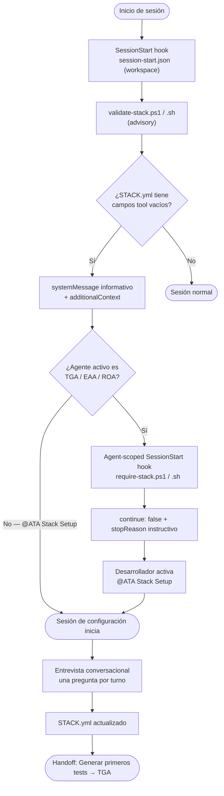

# Hooks de VS Code Copilot

## ¿Qué son los Hooks?

Los **Agent Hooks** son un mecanismo nativo de VS Code Copilot (Preview) que permite ejecutar comandos de shell en puntos específicos del ciclo de vida de una sesión de agente. A diferencia de las instrucciones o prompts —que guían el comportamiento del modelo de forma probabilística—, los hooks ejecutan código determinístico con resultados garantizados.

Los hooks se declaran en archivos `.json` dentro de `.github/hooks/` o directamente en el frontmatter YAML de un agente (agent-scoped hooks). Cada hook recibe un objeto JSON por `stdin` y puede devolver un objeto JSON por `stdout` para influir en la sesión.

> **Requisito:** Esta funcionalidad está en Preview. Verificar que esté habilitada en tu organización o en tu entorno local antes de intentar usarla. 
Los hooks de scope de agente requieren además activar `chat.useCustomAgentHooks: true` en la configuración de VS Code.

---

## Eventos del ciclo de vida disponibles

| Evento | Se dispara cuando… | Uso típico |
|--------|---------------------|------------|
| `SessionStart` | El usuario envía el primer prompt de una nueva sesión | Validar estado del proyecto, inyectar contexto inicial |
| `UserPromptSubmit` | El usuario envía un prompt | Auditar solicitudes, inyectar contexto de sistema |
| `PreToolUse` | Antes de que el agente invoque una herramienta | Bloquear operaciones peligrosas, requerir aprobación |
| `PostToolUse` | Después de que una herramienta completa con éxito | Ejecutar formateadores, linters, registrar resultados |
| `PreCompact` | Antes de compactar el contexto de conversación | Exportar contexto importante antes del truncado |
| `SubagentStart` | Se inicia un subagente | Inicializar recursos del subagente |
| `SubagentStop` | Un subagente completa | Agregar resultados, limpiar recursos |
| `Stop` | La sesión de agente termina | Generar reportes, enviar notificaciones |

---

## Formato de salida de un hook

Todo hook puede devolver un JSON con los siguientes campos de control:

```json
{
  "continue": false,
  "stopReason": "Mensaje visible para el usuario cuando continue es false",
  "systemMessage": "Banner visible en la UI del chat (funciona siempre)",
  "hookSpecificOutput": {
    "hookEventName": "SessionStart",
    "additionalContext": "Texto inyectado en el historial de conversación del agente"
  }
}
```

| Campo | Tipo | Efecto |
|-------|------|--------|
| `continue` | boolean | `false` detiene la sesión por completo |
| `stopReason` | string | Razón mostrada al usuario cuando `continue: false` |
| `systemMessage` | string | Banner de advertencia en la UI — se muestra siempre |
| `hookSpecificOutput.additionalContext` | string | Contexto inyectado en el historial del agente |

**Prioridad:** cuando múltiples mecanismos coexisten, el más restrictivo gana. El código de salida `2` bloquea la operación sin JSON; cualquier otro código no-cero emite una advertencia pero continúa.

---

## Arquitectura de hooks en ATA: dos capas

ATA implementa dos capas complementarias de hooks con comportamientos distintos:

### Capa 1 — Hook de workspace (advisory)

**Archivo:** `.github/hooks/session-start.json`
**Scripts:** `.ata/hooks/validate-stack.ps1` / `.ata/hooks/validate-stack.sh`
**Alcance:** Se dispara en **todas** las sesiones de agente del workspace.
**Comportamiento:** Si `STACK.yml` tiene campos `tool: ""` vacíos, inyecta un `systemMessage` informativo y `additionalContext` sugiriendo activar `@ATA Stack Setup`. No bloquea la sesión.

### Capa 2 — Agent-scoped hooks (bloqueantes)

**Scripts:** `.ata/hooks/require-stack.ps1` / `.ata/hooks/require-stack.sh`
**Alcance:** Declarados en el frontmatter `hooks` de **TGA**, **EAA** y **ROA** exclusivamente.
**Comportamiento:** Si `STACK.yml` tiene campos vacíos, retorna `continue: false`, deteniendo la sesión del agente con un `stopReason` claro que indica al usuario activar `@ATA Stack Setup`.

```yaml
# Ejemplo del frontmatter en tga.agent.md / eaa.agent.md / roa.agent.md
hooks:
  SessionStart:
    - type: command
      command: "bash .ata/hooks/require-stack.sh"
      windows: "powershell -ExecutionPolicy Bypass -NoProfile -File .ata\\hooks\\require-stack.ps1"
      cwd: "."
      timeout: 10
```

El agente `@ATA Stack Setup` **no tiene agent-scoped hook** — nunca se bloquea, ya que es precisamente el agente responsable de crear y completar `STACK.yml`.

---

## Flujo completo SessionStart → entrevista → stack configurado



---

## Consideraciones de seguridad

Los hooks ejecutan comandos de shell con los mismos permisos que VS Code. Seguir estas prácticas al trabajar con hooks del proyecto:

- **Revisar siempre** los scripts antes de habilitarlos en repositorios compartidos.
- **Validar el input:** los scripts reciben datos del agente via `stdin` — sanitizar toda entrada.
- **Nunca hardcodear credenciales** en scripts de hooks. Usar variables de entorno o almacenamiento seguro.
- **Establecer** `chat.tools.edits.autoApprove: false` para evitar que el agente modifique los propios scripts de hooks durante su ejecución.
