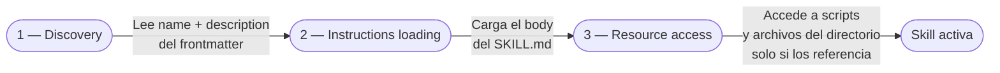

# Agent Skills de VS Code Copilot

## ¿Qué son las Agent Skills?

Las **Agent Skills** son carpetas de instrucciones, scripts y recursos que GitHub Copilot carga automáticamente cuando el contexto de la conversación es relevante para ellas. Cada skill se define en un directorio propio con un archivo `SKILL.md` que contiene el frontmatter de metadatos y el cuerpo con las instrucciones.

Agent Skills sigue un **estándar abierto** ([agentskills.io](https://agentskills.io/)) que garantiza portabilidad: una skill creada en VS Code funciona también en GitHub Copilot CLI y en el Copilot coding agent.

> **Tip**: Las skills permiten que el agente adquiera capacidades especializadas **bajo demanda**, sin consumir tokens de contexto cuando no son relevantes.

---

## Skills vs Instrucciones personalizadas

| Dimensión | Agent Skills | Instrucciones personalizadas |
|-----------|-------------|------------------------------|
| Propósito | Capacidades y flujos de trabajo especializados | Estándares de código y convenciones |
| Portabilidad | VS Code, Copilot CLI, coding agent | VS Code y GitHub.com |
| Contenido | Instrucciones + scripts + ejemplos + recursos | Solo instrucciones |
| Alcance | Específica por tarea, cargada bajo demanda | Siempre aplicada (o por glob pattern) |
| Estándar | Abierto (agentskills.io) | Específico de VS Code |

---

## Carga progresiva

El modelo carga las skills en tres niveles para mantener el contexto eficiente:



| Nivel | Qué carga | Cuándo ocurre |
|-------|-----------|---------------|
| **1 — Discovery** | `name` y `description` del frontmatter | Siempre, al listar skills disponibles |
| **2 — Instructions loading** | Cuerpo completo del `SKILL.md` | Cuando la IA determina que la skill es relevante, o al invocarla explícitamente con `/nombre-skill` |
| **3 — Resource access** | Scripts, ejemplos y archivos del directorio | Solo cuando la IA los referencia durante la ejecución |

---

## Ubicaciones de las skills

| Ámbito | Carpeta |
|--------|---------|
| Proyecto (workspace) | `.github/skills/`, `.claude/skills/`, `.agents/skills/` |
| Perfil de usuario (global) | `~/.copilot/skills/`, `~/.claude/skills/`, `~/.agents/skills/` |

Se pueden agregar ubicaciones adicionales con el setting `chat.agentSkillsLocations`.

> **Convención ATA**: las skills del proyecto se almacenan en `.ata/skills/` y se referencian desde `STACK.yml` via `skill_file`. El directorio `.github/skills/` queda disponible para skills no-ATA del proyecto.

---

## Estructura de directorios

Cada skill vive en su propio subdirectorio. El nombre del directorio **debe coincidir** con el campo `name` del frontmatter:

```
.ata/skills/
└── playwright/                 # nombre del directorio = name en SKILL.md
    ├── SKILL.md                # requerido
    ├── fixtures/               # recursos opcionales
    │   └── page-object.ts
    └── examples/
        └── login.spec.ts
```

---

## Formato del archivo `SKILL.md`

### Encabezado (frontmatter YAML — requerido)

```yaml
---
name: playwright
description: >
  Genera y ejecuta tests end-to-end con Playwright.
  Usar cuando el usuario solicite tests e2e, pruebas de interfaz,
  flujos de usuario o validaciones de navegador.
argument-hint: "[archivo o URL a testear] [opciones]"
user-invocable: true
disable-model-invocation: false
---
```

### Tabla de propiedades del frontmatter

| Propiedad | Requerida | Descripción |
|-----------|-----------|-------------|
| `name` | Sí | Identificador único de la skill. Minúsculas con guiones. Máx. 64 caracteres. Debe coincidir con el nombre del directorio. |
| `description` | Sí | Descripción de qué hace la skill y cuándo usarla. Sé específico para que Copilot pueda decidir cuándo cargarla automáticamente. Máx. 1024 caracteres. |
| `argument-hint` | No | Texto de ayuda mostrado en el input del chat al invocar la skill como slash command. |
| `user-invocable` | No | `true` (default): la skill aparece en el menú `/`. `false`: la skill no aparece en el menú pero el modelo puede cargarla automáticamente. |
| `disable-model-invocation` | No | `false` (default): el modelo puede cargar la skill automáticamente por relevancia. `true`: solo se puede invocar manualmente con `/nombre-skill`. |

### Tabla de comportamiento por combinación de propiedades

| `user-invocable` | `disable-model-invocation` | Aparece en `/` | Carga automática | Caso de uso |
|:----------------:|:--------------------------:|:--------------:|:----------------:|-------------|
| `true` (default) | `false` (default) | ✅ | ✅ | Skills de propósito general |
| `false` | `false` | ❌ | ✅ | Conocimiento de fondo que el modelo carga si lo necesita |
| `true` | `true` | ✅ | ❌ | Skills que solo deben ejecutarse bajo demanda explícita |
| `false` | `true` | ❌ | ❌ | Skill deshabilitada |

### Cuerpo (body)

El cuerpo contiene las instrucciones, guías y ejemplos que Copilot sigue al usar la skill.

- Describí qué ayuda a lograr la skill.
- Indicá cuándo usarla.
- Incluí procedimientos paso a paso.
- Referenciá archivos del directorio con paths relativos: `[template de test](./fixtures/page-object.ts)`.

### Ejemplo completo

```markdown
---
name: playwright
description: >
  Genera tests end-to-end con Playwright usando el Page Object Model.
  Usar cuando se soliciten tests de interfaz, flujos de usuario o
  validaciones de comportamiento en navegador.
argument-hint: "[componente o URL a testear]"
---

# Playwright — Generación de Tests E2E

## Convenciones del proyecto

- Todos los tests usan el **Page Object Model** (ver [plantilla](./fixtures/page-object.ts)).
- Archivos en `tests/e2e/` con extensión `.spec.ts`.
- Usar `expect(locator).toBeVisible()` sobre `waitForSelector`.

## Procedimiento de generación

1. Identificar los flujos de usuario del requisito.
2. Crear un Page Object por página/componente testeado.
3. Escribir un `describe` por flujo, con `test` por escenario.
4. Agregar `test.use({ baseURL })` tomando el valor de `STACK.yml → base_url_local`.

## Ejemplo de test generado

Ver [login.spec.ts](./examples/login.spec.ts) como referencia.
```

---

## Invocación como slash command

Las skills disponibles aparecen en el menú `/` del chat. Para invocar una skill manualmente:

```
/playwright para el flujo de checkout
/vitest src/utils/formatDate.ts
```

El texto después del nombre de la skill se pasa como contexto adicional a la skill.

---

## Skills en ATA

La arquitectura ATA usa skills para implementar el **Progressive Disclosure** de capacidades: el orquestador conoce solo el `name` y `description` de cada skill al inicio de la sesión. Una skill se carga completamente **solo cuando el Domain Agent la invoca** — nunca más de una skill por subdominio al mismo tiempo.

### Política ATA (obligatoria)

En ATA, la creación de skills es obligatoria para toda herramienta declarada en `STACK.yml`.
Esta tarea corresponde al agente `ATA Stack Setup` durante la configuración inicial o actualización del stack.

También deben crearse skills para herramientas de contenedores/orquestación cuando se declaren:

- runtime: `docker` o `podman`
- compose: `docker compose`, `docker-compose`, `podman-compose`
- kubernetes: `kubectl`, `helm`, `kustomize`

La referencia a cada skill se declara en `STACK.yml`:

```yaml
tga_skills:
  unit_testing:
    tool: "vitest"
    output_ext: ".test.ts"
    skill_file: ".ata/skills/vitest/SKILL.md"   # ← ruta a la skill
  e2e:
    tool: "playwright"
    output_ext: ".spec.ts"
    skill_file: ".ata/skills/playwright/SKILL.md"
```

Cuando TGA resuelve el stack al inicio de la sesión:

1. Lee `STACK.yml` para determinar qué tool está activo por dominio.
2. Si `skill_file` apunta a un `.md` existente, lo carga antes de operar.
3. Si `skill_file` está vacío, usa las instrucciones generales del agente.

Una skill cargada en una sesión **no persiste** a la siguiente (alineado con el principio de sesiones efímeras de ATA).

---

## Skills compartidas

- [**github/awesome-copilot**](https://github.com/github/awesome-copilot) — colección comunitaria de skills, agentes, instrucciones y prompts.
- [**anthropics/skills**](https://github.com/anthropics/skills) — skills de referencia de Anthropic.

> Siempre revisá una skill externa antes de usarla. Verificá que los scripts incluidos no ejecuten código malicioso ni exfiltren datos. Revisá los permisos que solicita en el cuerpo de las instrucciones.

---

## Consideraciones de seguridad

- **Revisión antes de instalar**: una skill puede incluir scripts arbitrarios en su directorio. Revisá el contenido completo antes de copiar una skill externa a tu proyecto.
- **Auto-aprobación de terminal**: si la skill ejecuta comandos de terminal, configurá listas de aprobación estrictas (`terminal.integrated.confirmOnKill`, allow-lists de comandos) para evitar ejecución no autorizada.
- **description precisa**: una descripción vaga puede hacer que el modelo cargue la skill en contextos no deseados. Especificá los casos de uso positivos **y** negativos (ej.: "No usar para análisis estático — usar para generación de tests de integración").
- **disable-model-invocation: true** para skills con efectos secundarios (ej.: scripts que escriben archivos o llaman APIs externas): requería invocación explícita del usuario.
